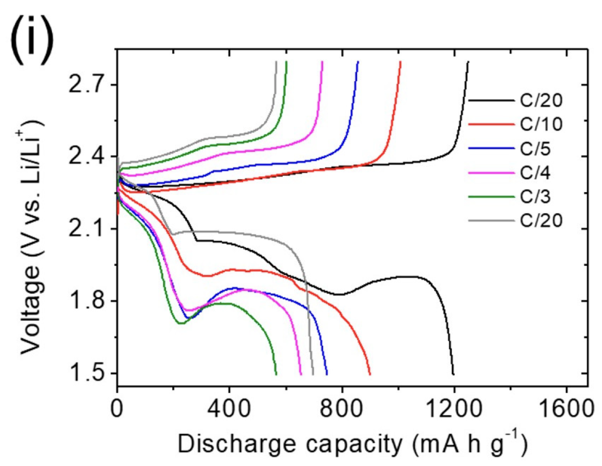
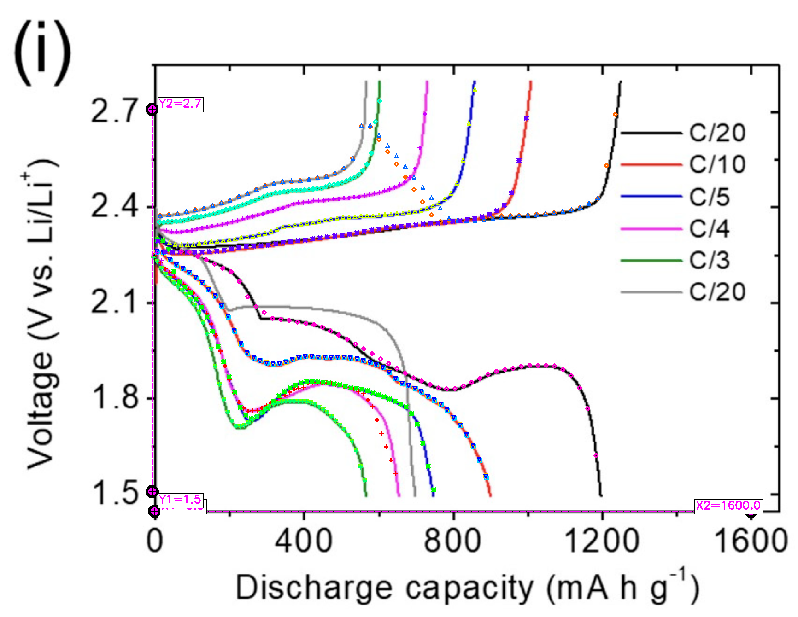
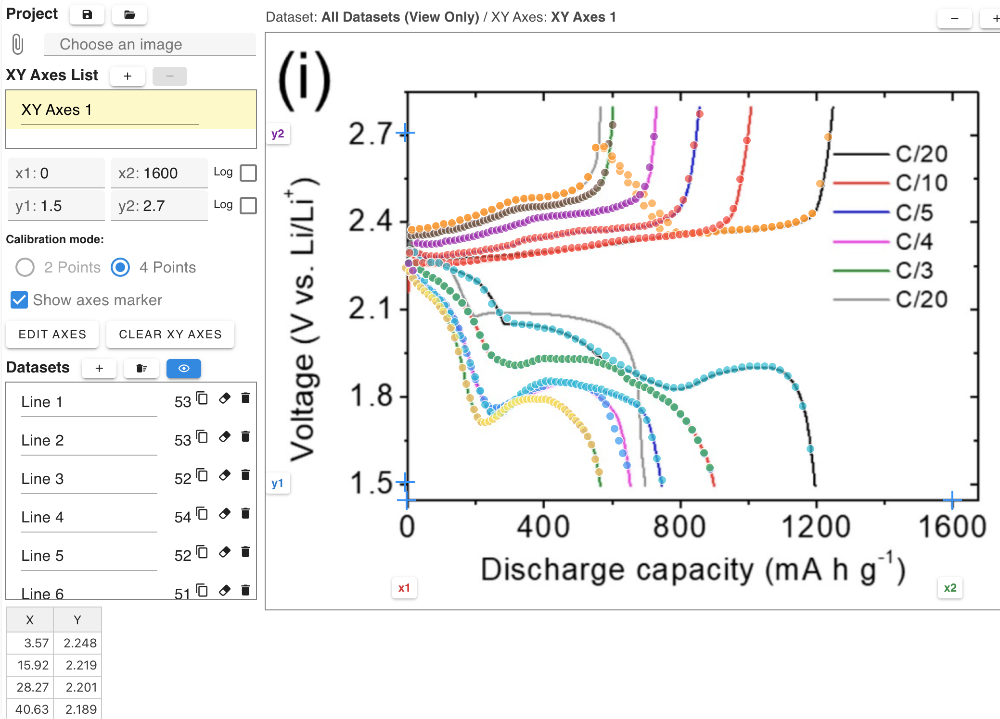
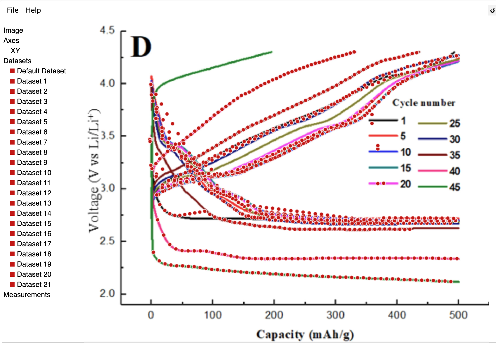

# AutoLineDigitizer

A desktop application for automatic line chart data extraction using [LineFormer](https://github.com/TheJaeLal/LineFormer) with automatic axis detection via [ChartDete](https://github.com/pengyu965/ChartDete/) and [EasyOCR](https://github.com/JaidedAI/EasyOCR).

## Demo

### Video

https://github.com/user-attachments/assets/7ecb641e-f939-40a5-ad7b-54b64937fdd4

### Input / Output

| Input | Output |
|-------|--------|
|  |  |

### Export to Digitizer Tools

| [StarryDigitizer](https://starrydigitizer.vercel.app/) | [WebPlotDigitizer](https://apps.automeris.io/wpd4/) |
|------------------|------------------|
|  |  |

## Features

- **Line Extraction**: Automatic line detection using LineFormer
- **Axis Detection**: Automatic axis label reading via ChartDete + OCR
- **Export Formats**:
  - [StarryDigitizer](https://starrydigitizer.vercel.app/) ZIP
  - [WebPlotDigitizer](https://apps.automeris.io/wpd4/) TAR

## Download

Download the latest version from the [Releases](https://github.com/t29mato/AutoLineDigitizer/releases) page.

| Platform | File |
|----------|------|
| macOS (Apple Silicon) | `AutoLineDigitizer-macOS.zip` |
| Windows | `AutoLineDigitizer-Windows.zip` |

> **Note:** Intel Mac is not currently supported. Apple Silicon (M1/M2/M3/M4) only.

### Installation

#### macOS

1. Download and unzip `AutoLineDigitizer-macOS.zip`
2. Move `AutoLineDigitizer.app` to Applications
3. On first launch, macOS will show a warning: **"AutoLineDigitizer.app cannot be opened because the developer cannot be verified."**
   - Click **Cancel** (not "Move to Trash")
   - Go to **System Settings → Privacy & Security** → scroll down and click **"Open Anyway"**
   - Or: **Right-click** the app → **Open** → click **Open** in the dialog
4. Models will be downloaded automatically on first launch

#### Windows

1. Download and unzip `AutoLineDigitizer-Windows.zip`
2. Run `AutoLineDigitizer\AutoLineDigitizer.exe`
3. Models will be downloaded automatically on first launch

---

## Image Attribution

Demo images are used under the following licenses:

- **demo/10.3390_nano14040384_4i.png**: Figure 4(i) from [Wang et al., Nanomaterials, 2024](https://doi.org/10.3390/nano14040384), licensed under [CC BY 4.0](https://creativecommons.org/licenses/by/4.0/)

---

## License

This project is licensed under the MIT License - see the [LICENSE](LICENSE) file for details.

### Third-Party Components

- **LineFormer**: [ICDAR 2023 Paper](https://link.springer.com/chapter/10.1007/978-3-031-41734-4_24) by Jay Lal et al.
- **ChartDete**: MIT License, Copyright (c) 2023 Pengyu Yan
- **MMDetection**: Apache License 2.0, Copyright (c) 2018-2023 OpenMMLab
